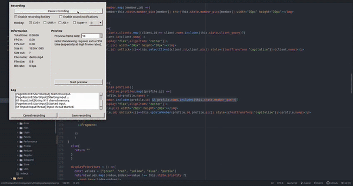
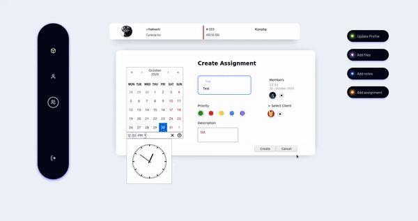
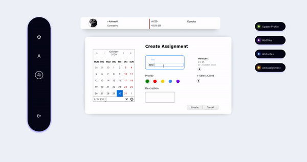

 # Basic CRM

A simple CRM build using [Django Rest Framework](https://github.com/encode/django-rest-framework) and [ReactJs](https://github.com/facebook/react).

 


## Installation

Follow the sequence.


```shell
#Virtual Env setup

sudo apt install python3-venv
python3 -m venv venv

#Activate Virtual Env 
source venv/bin/activate
pip3 install -r requirements.txt
```

## Usage
```
cd crm
python3 manage.py makemigrations accounts
python3 manage.py makemigrations api
python3 manage.py migrate
python3 manage.py runserver

```
Open another Terminal cd into the root directory and run npm

```shell
 npm install
 npm run dev
```


## License
[MIT](https://choosealicense.com/licenses/mit/)
